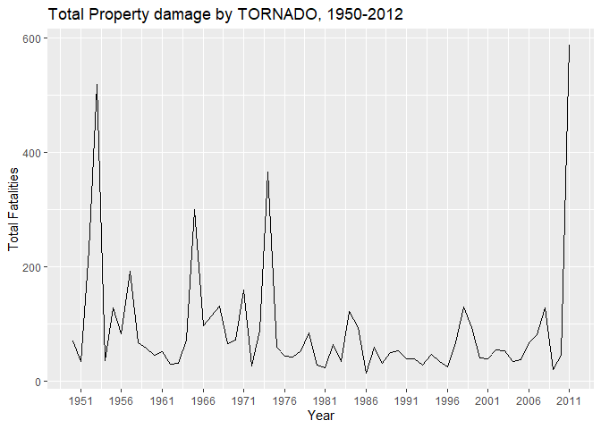
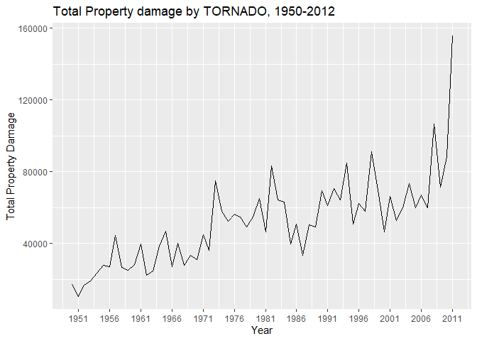

## Introduction

Severe weather conditions like storms can bring about a host of issues that can affect both the public's health and the economy of municipalities and communities. Such events have the potential to cause fatalities, injuries, and damage to property, and mitigating such outcomes is a top priority. To this end, the U.S. National Oceanic and Atmospheric Administration's (NOAA) storm database serves as a crucial resource for examining the characteristics of significant storms and weather events in the United States. The database contains data on the time and location of such events, along with estimated figures for any loss of life, injuries, and damage to property.

This project involves exploring the U.S. National Oceanic and Atmospheric Administration's (NOAA) storm database and determine which events cause the most harm to populations in respect to health and property damage

## Data

The data for this assignment come in the form of a comma-separated-value file compressed via the bzip2 algorithm to reduce its size. Data is downloaded automatically from the source

* [Storm Data][data]

There is also some documentation of the database available. Here you will find how some of the variables are constructed/defined.

* National Weather Service Storm Data [Documentation][doc]

* National Climatic Data Center Storm Events [FAQ][faq]

The events in the database start in the year 1950 and end in November 2011. In the earlier years of the database there are generally fewer events recorded, most likely due to a lack of good records. More recent years should be considered more complete.

## Data Processing

Data described above is downloaded and loaded into R using code described below, dates are interpreted from string into R date objects. A summary of the data is outputted.


```r
download.file('https://d396qusza40orc.cloudfront.net/repdata%2Fdata%2FStormData.csv.bz2',destfile = 'files/data/stormdata.csv.bz2')
stormdata <- read.csv('files/data/stormdata.csv.bz2',header = T,sep = ',',quote = '"',na.strings = 'NA')

stormdata <- stormdata %>% mutate(across(c('BGN_DATE', 'END_DATE'), function(x){
  mdy(str_split_fixed(x," ",2)[,1])
  }))
stormdata$EVTYPE <- as.factor(stormdata$EVTYPE)
print.money <- function(x, ...) {
  print.default(paste0("$", formatC(as.numeric(x), format="f", digits=2, big.mark=",")))
}
```

### Data Transformations

Some columns require transformation, such as BGN_DATE into proper data formats

## Data analysis

This analysis aims to answer two questions from the supplied data:

1 Across the United States, which types of events are most harmful with respect to population health?

2 Across the United States, which types of events have the greatest economic consequences?

### Population health hazards (1)

In order to get the event with highest hazard towards the population we have to summarize the total amount of fatalities for each event type:


```r
stormdata_yearly_fat <- stormdata %>% group_by(EVTYPE) %>% summarise(FATALITIES=sum(FATALITIES))
most_harmful <- stormdata_yearly_fat[which.max(stormdata_yearly_fat$FATALITIES),]
stormdata_fat <- stormdata %>% filter(EVTYPE==most_harmful$EVTYPE) %>% mutate(year=as.Date(floor_date(BGN_DATE,unit='years'))) %>% 
  group_by(year) %>% summarise(FATALITIES=sum(FATALITIES))
ggplot(stormdata_fat, aes(year,FATALITIES)) + 
  geom_line(stat = "summary", fun = "sum") +
  scale_x_date(date_breaks = "5 year", date_labels =  "%Y") +
  ggtitle(paste0("Total Property damage by ",most_harmful$EVTYPE,", 1950-2012")) +
  xlab("Year") + ylab("Total Fatalities")
```

<!-- -->

### Greatest economic consequences (2)

In order to get the event with highest economic consequences we have to summarize the total property damage for each event type:


```r
stormdata_yearly_dmg <- stormdata %>% group_by(EVTYPE) %>% summarise(PROPDMG=sum(PROPDMG))
most_dmg <- stormdata_yearly_dmg[which.max(stormdata_yearly_dmg$PROPDMG),]
stormdata_dmg <- stormdata %>% filter(EVTYPE==most_dmg$EVTYPE) %>% mutate(year=as.Date(floor_date(BGN_DATE,unit='years'))) %>% 
  group_by(year) %>% summarise(PROPDMG=sum(PROPDMG))
ggplot(stormdata_dmg, aes(year,PROPDMG)) + 
  geom_line(stat = "summary", fun = "sum") +
  scale_x_date(date_breaks = "5 year", date_labels =  "%Y") +
  ggtitle(paste0("Total Property damage by ",most_dmg$EVTYPE,", 1950-2012")) +
  xlab("Year") + ylab("Total Property Damage")
```

<!-- -->

```r
dmg <- print.money(most_dmg$PROPDMG*1000)
```

```
## [1] "$3,212,258,160.00"
```

## Results

### Population health hazards (1)

Considering death the biggest hazard to population health, the event with highest fatalities is TORNADO with a total of 5633

### Greatest economic consequences (2)

Considering the event with highest economic consequences being the amount of property damage, the event with highest total is TORNADO with a total of $3,212,258,160.00 USD Dollars 


[data]:https://d396qusza40orc.cloudfront.net/repdata%2Fdata%2FStormData.csv.bz2
[doc]:https://d396qusza40orc.cloudfront.net/repdata%2Fpeer2_doc%2Fpd01016005curr.pdf
[faq]:https://d396qusza40orc.cloudfront.net/repdata%2Fpeer2_doc%2FNCDC%20Storm%20Events-FAQ%20Page.pdf
